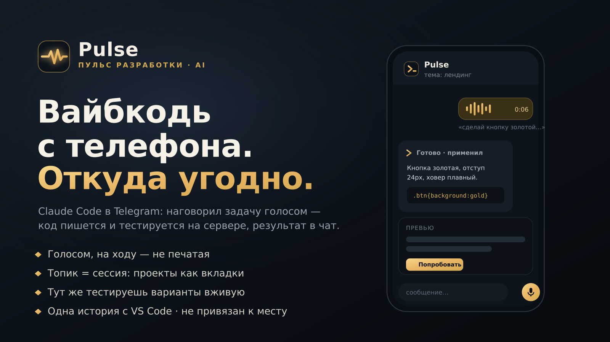

<div align="center">


# Pulse

**Пульт от Claude Code в вашем Telegram · A Telegram remote for Claude Code**

Управляйте сессиями Claude Code на сервере прямо с телефона — как вкладками в редакторе.
Manage Claude Code sessions on your server right from your phone — like tabs in your editor.

**Вайбкодинг без ПК:** голосом и текстом рулите сервером и кодом, ведёте несколько сессий параллельно — всё из Telegram.
**Vibe-coding without a PC:** run your server and code by voice or text, juggle several sessions in parallel — all from Telegram.

<sub>MIT License · Автор / Author: <a href="https://t.me/naworkal">@naworkal</a></sub>



**[Русский](#русский) · [English](#english)**

</div>

---

> **Не программист?** Установка в один шаг: откройте **Claude Code** на сервере и вставьте готовый запрос — он сам всё скачает, настроит и проведёт вас по шагам (токен, группа, запуск). Смотрите раздел [«Самый простой способ — через Claude Code»](#самый-простой-способ--через-claude-code-для-непрограммистов).
>
> **Not a programmer?** One-step install: open **Claude Code** on your server and paste the ready prompt — it downloads, configures and walks you through everything. See ["Easiest way — via Claude Code"](#easiest-way--via-claude-code-for-non-programmers).

---

<a name="русский"></a>
# Русский

## Что это

Pulse превращает **супергруппу Telegram с Темами** в удалённый пульт для [Claude Code](https://claude.com/claude-code).
Каждая **Тема** (топик) группы — это отдельная **сессия** Claude Code на вашем сервере.
Пишете текст или голосовое в тему — оно уходит в её сессию, ответы и прогресс приходят обратно в реальном времени.

Именно связка «Темы Telegram ↔ сессии Claude» — главная фишка: у вас в кармане столько параллельных
рабочих сессий, сколько нужно, и вы переключаетесь между ними как между вкладками.

- Одна Тема = одна вкладка. Открыли новую — свежая сессия. Открыли из истории — продолжили с того же места.
- Сессии те же, что в редакторе: подхватываются нативно по `--resume <id>`. Написали с телефона — в VS Code видно ту же переписку.
- Режим автопилота: инструменты выполняются без переспросов (тот же аккаунт/подписка, что в редакторе).

## Возможности

- **Темы ↔ сессии** — десятки параллельных сессий, каждая в своей теме.
- **История сессий** — список прошлых сессий с датой и превью; открытие продолжает с полной историей.
- **Голосовые команды** — распознавание через Deepgram / Яндекс SpeechKit / Whisper / Gemini / Vertex с авто-фолбэком.
- **Фото + задача** — картинка с подписью уходит в сессию как контекст.
- **Живой стрим** — ответ и прогресс инструментов редактируются в сообщении на лету.
- **Выбор модели** — Opus / Sonnet / Haiku / Fable / Авто, режим `ultracode`.
- **Только владелец** — доступ у того, кто активировал бота секретом.
- **Переживает перезапуск** — сессии и незавершённые задачи хранятся в SQLite и возобновляются.

## Как устроено

```
Telegram (супергруппа с Темами)
   Тема №1        Тема №2        Тема №3
   (сессия A)     (сессия B)     (сессия C)
        │  текст / голос / фото
        ▼
   Pulse (bot.py, python-telegram-bot)
        │  claude -p "<текст>" --resume <session_id>
        │  --output-format stream-json --permission-mode acceptEdits
        ▼
   Claude Code CLI (headless)  ──►  ваш сервер / репозитории
```

Движок — CLI `claude` в headless-режиме, по одному подпроцессу на активную тему.
Связка «тема ↔ сессия», модель, папка и счётчики токенов хранятся в `bot.db` (SQLite).

---

## Пошаговая настройка

### Самый простой способ — через Claude Code (для непрограммистов)

Если на сервере (или ПК) уже установлен **Claude Code** — не нужно вводить команды вручную.
Откройте Claude Code и **вставьте этот запрос** — он всё сделает сам и проведёт вас по шагам:

```
Установи и настрой бота Pulse из https://github.com/sotvorcov/pulse-tg-bot на этом сервере.
Я не программист — объясняй простыми словами и делай по шагам:
1. Склонируй репозиторий и поставь зависимости (pip install -r requirements.txt).
2. Спроси у меня токен бота от @BotFather и придуманный секрет владельца, создай .env из .env.example.
3. Пошагово объясни, как создать в Telegram супергруппу с Темами, добавить бота и выдать ему право «Управление темами».
4. Настрой автозапуск через systemd, запусти бота и покажи логи.
5. Скажи, что именно написать боту, чтобы я стал владельцем.
```

- Claude Code на сервере — **сделает установку сам**. Если он у вас только на ПК — он **продиктует простые команды**, которые нужно выполнить на сервере.
- От вас нужно только: вставить токен бота, придумать секрет и создать группу в Telegram (Claude подскажет каждый шаг).

Не хотите через Claude Code? Ниже — та же настройка вручную.

### Шаг 1. Требования

- Сервер или ПК, где **уже установлен и залогинен** [Claude Code](https://claude.com/claude-code) (`claude` в `PATH`).
- Python 3.11+.

### Шаг 2. Код и зависимости

```bash
git clone https://github.com/sotvorcov/pulse-tg-bot.git
cd pulse-tg-bot
pip install -r requirements.txt
```

### Шаг 3. Создать бота в Telegram

1. Откройте [@BotFather](https://t.me/BotFather) → команда `/newbot`.
2. Задайте имя и username бота.
3. BotFather выдаст **токен** вида `123456:ABC...` — скопируйте.

### Шаг 4. Заполнить `.env`

```bash
cp .env.example .env
```

Откройте `.env` и впишите минимум:
- `BOT_TOKEN=` — токен из BotFather.
- `OWNER_SETUP_SECRET=` — любой ваш секрет (пароль активации владельца).

(Ключи для голоса — по желанию, см. раздел «Голос».)

### Шаг 5. Создать супергруппу с Темами

Тема (Topic) — это отдельная «ветка» внутри группы. Они есть только в **супергруппах-форумах**.

1. В Telegram: **Новая группа** → дайте название (например, «Мой Claude») → добавьте хотя бы себя, можно сразу и бота.
2. Откройте группу → тапните по её **названию сверху** → **Изменить** (карандаш).
3. Включите переключатель **«Темы»** (Topics). Telegram превратит группу в супергруппу-форум.
4. Сохраните. Теперь вместо обычной ленты будет **список Тем**.

### Шаг 6. Добавить бота и выдать права

1. В группе: название сверху → **Администраторы** → **Добавить администратора** → выберите вашего бота (по username).
2. Обязательно включите право **«Управление темами» (Manage Topics)** — без него бот не сможет создавать и закрывать темы.
3. Оставьте включённой отправку сообщений. Сохраните.

> Если бота ещё нет в группе — сначала «Добавить участника» по username, затем повысьте до администратора.

### Шаг 7. Запуск

**Прод (автозапуск и автоперезапуск через systemd):**

```bash
cp tg-claude-bot.service /etc/systemd/system/pulse.service
# внутри файла проверьте пути: WorkingDirectory и EnvironmentFile
systemctl daemon-reload
systemctl enable --now pulse
journalctl -u pulse -f        # смотреть логи
```

**Быстрый тест без systemd:**

```bash
bash run.sh
```

### Шаг 8. Стать владельцем

Напишите боту (в личке или в группе):

```
/start <ваш OWNER_SETUP_SECRET>
```

Первый, кто активировал секрет, становится **владельцем**. Остальные пользователи игнорируются.

---

## Как пользоваться

### Создать сессию

- Нажмите кнопку **«Новая сессия»** (или `/new`) — Pulse создаст **новую Тему** и запустит свежую сессию Claude Code в ней.
- Либо откройте **«История сессий»** — список прошлых сессий; выбор открывает сессию **в новой Теме с полной историей**, и вы продолжаете с того же места.

### Переключение между Темами (= между сессиями)

- В супергруппе-форуме группа открывается **списком Тем**. Тапните по Теме — вошли в её сессию. Кнопка «назад» — обратно к списку.
- Каждая Тема — **независимая сессия**: свой контекст, своя история, своя рабочая папка. Переключение Тем = переключение между параллельными задачами.
- Можно «закрепить» важные Темы наверху (стандартная функция Telegram).

### Работа внутри Темы

- Пишите **текст** — уходит в сессию этой Темы как запрос.
- Отправляйте **голосовое** — Pulse распознает речь и отправит текстом (нужен хотя бы один ключ ASR).
- Кидайте **фото с подписью** — картинка идёт в сессию как контекст к задаче.
- Ответ и прогресс инструментов **редактируются прямо в сообщении** в реальном времени.

### Команды

| Команда | Действие |
|---|---|
| `/start <секрет>` | Активация владельца |
| `/new` | Новая сессия (новая Тема) |
| `/model` | Выбор модели (Opus / Sonnet / Haiku / Fable / Авто) |
| `/voice` | Провайдер распознавания голоса |
| `/cwd <путь>` | Рабочая папка сессии |
| `/ultra` | Режим `ultracode` |
| `/cost` | Сколько потрачено токенов |
| `/settings` | Тумблеры (в т.ч. авто-сжатие контекста) |
| `/stop` | Прервать текущую задачу |
| `/help` | Справка |

---

## Настройка `.env`

| Переменная | Назначение |
|---|---|
| `BOT_TOKEN` | Токен бота от @BotFather (обязательно) |
| `OWNER_SETUP_SECRET` | Секрет активации владельца (обязательно) |
| `CLAUDE_BIN` | Путь к бинарю `claude` |
| `DEFAULT_CWD` | Рабочая папка по умолчанию |
| `SESS_DIR` | Папка сессий Claude Code (`.jsonl`) |
| `ALLOWED_TOOLS` | Список разрешённых инструментов автопилота |
| `DEEPGRAM_API_KEY` | Голос: Deepgram (рекомендуется) |
| `YANDEX_API_KEY` / `YANDEX_FOLDER_ID` | Голос: Яндекс SpeechKit |
| `OPENAI_API_KEY` | Голос: OpenAI Whisper |
| `GEMINI_API_KEY` | Голос: Google Gemini |
| `VERTEX_SA_PATH` | Голос: Google Vertex (сервис-аккаунт) |

## Голос (распознавание)

Достаточно **одного** ключа. Pulse пробует провайдеров по очереди с авто-фолбэком:
**Deepgram → Яндекс SpeechKit → Gemini → OpenAI Whisper → Vertex.**
Без единого ключа голос выключен, текст работает. Переключить провайдера — команда `/voice`.

## Управление контекстом

Длинные сессии можно **сжимать** (`/compact`), чтобы не упираться в лимит контекста.
Авто-сжатие — тумблер в `/settings` (по умолчанию выключено). Включите, если хотите, чтобы Pulse
сжимал контекст автоматически при подходе к порогу.

## Безопасность

- Доступ только у владельца; активация закрыта секретом `OWNER_SETUP_SECRET`.
- Автопилот — через `--permission-mode acceptEdits` + список `ALLOWED_TOOLS`. `Bash` в списке = **любые команды**: держите бота приватным и запускайте под пользователем с нужным уровнем прав.
- Секреты — только в `.env` (в репозиторий не попадают, см. `.gitignore`).

---

<a name="english"></a>
# English

## What it is

Pulse turns a **Telegram supergroup with Topics** into a remote control for [Claude Code](https://claude.com/claude-code).
Each **Topic** in the group is a separate Claude Code **session** on your server.
Send text or a voice message into a topic — it goes to that session, and responses and tool progress
stream back in real time.

The Telegram-topics ↔ Claude-sessions mapping is the core idea: you carry as many parallel working
sessions as you like and switch between them like editor tabs.

- One Topic = one tab. Open a new one for a fresh session, or open from history to resume where you left off.
- Sessions are the same as in your editor: resumed natively by `--resume <id>`. A message sent from your phone shows up in VS Code too.
- Autopilot mode: tools run without prompts (same account/subscription as in the editor).

## Features

- **Topics ↔ sessions** — dozens of parallel sessions, each in its own topic.
- **Session history** — list of past sessions with date and preview; opening resumes full history.
- **Voice commands** — transcription via Deepgram / Yandex SpeechKit / Whisper / Gemini / Vertex with automatic fallback.
- **Photo + task** — an image with a caption goes into the session as context.
- **Live streaming** — the reply and tool progress are edited into the message on the fly.
- **Model picker** — Opus / Sonnet / Haiku / Fable / Auto, plus `ultracode` mode.
- **Owner-only** — access limited to whoever activated the bot with the secret.
- **Survives restarts** — sessions and in-flight tasks are stored in SQLite and resumed.

## How it works

```
Telegram (supergroup with Topics)
   Topic #1       Topic #2       Topic #3
   (session A)    (session B)    (session C)
        │  text / voice / photo
        ▼
   Pulse (bot.py, python-telegram-bot)
        │  claude -p "<text>" --resume <session_id>
        │  --output-format stream-json --permission-mode acceptEdits
        ▼
   Claude Code CLI (headless)  ──►  your server / repos
```

The engine is the `claude` CLI in headless mode, one subprocess per active topic.
The topic↔session mapping, model, working dir and token counters live in `bot.db` (SQLite).

---

## Step-by-step setup

### Easiest way — via Claude Code (for non-programmers)

If **Claude Code** is already installed on your server (or PC), you don't need to type commands by hand.
Open Claude Code and **paste this prompt** — it will do everything and walk you through it:

```
Install and set up the Pulse bot from https://github.com/sotvorcov/pulse-tg-bot on this server.
I'm not a programmer — explain in plain words and go step by step:
1. Clone the repo and install dependencies (pip install -r requirements.txt).
2. Ask me for the bot token from @BotFather and an owner secret, then create .env from .env.example.
3. Walk me through creating a Telegram supergroup with Topics, adding the bot, and granting it "Manage Topics".
4. Set up autostart via systemd, launch the bot and show the logs.
5. Tell me exactly what to send the bot so I become the owner.
```

- Claude Code on the server will **do the install itself**. If you only have it on your PC, it will **dictate the simple commands** to run on the server.
- All you provide: the bot token, a secret you choose, and creating the Telegram group (Claude guides every step).

Prefer to do it yourself? The same setup, manually, is below.

### Step 1. Requirements

- A server or PC with [Claude Code](https://claude.com/claude-code) **already installed and logged in** (`claude` in `PATH`).
- Python 3.11+.

### Step 2. Code and dependencies

```bash
git clone https://github.com/sotvorcov/pulse-tg-bot.git
cd pulse-tg-bot
pip install -r requirements.txt
```

### Step 3. Create a bot in Telegram

1. Open [@BotFather](https://t.me/BotFather) → `/newbot`.
2. Set a name and username.
3. BotFather returns a **token** like `123456:ABC...` — copy it.

### Step 4. Fill in `.env`

```bash
cp .env.example .env
```

Set at least:
- `BOT_TOKEN=` — the token from BotFather.
- `OWNER_SETUP_SECRET=` — any secret of yours (owner activation password).

(Voice keys are optional — see "Voice".)

### Step 5. Create a supergroup with Topics

A Topic is a separate thread inside a group. Topics exist only in **forum supergroups**.

1. In Telegram: **New Group** → give it a name (e.g. "My Claude") → add at least yourself, optionally the bot.
2. Open the group → tap its **title at the top** → **Edit** (pencil).
3. Turn on the **"Topics"** toggle. Telegram converts the group into a forum supergroup.
4. Save. Instead of a single feed you now get a **list of Topics**.

### Step 6. Add the bot and grant rights

1. In the group: title → **Administrators** → **Add Admin** → pick your bot (by username).
2. Enable the **"Manage Topics"** permission — without it the bot cannot create or close topics.
3. Keep message sending enabled. Save.

> If the bot isn't in the group yet, "Add Member" by username first, then promote to admin.

### Step 7. Run

**Production (autostart and auto-restart via systemd):**

```bash
cp tg-claude-bot.service /etc/systemd/system/pulse.service
# inside the file check the paths: WorkingDirectory and EnvironmentFile
systemctl daemon-reload
systemctl enable --now pulse
journalctl -u pulse -f        # follow logs
```

**Quick test without systemd:**

```bash
bash run.sh
```

### Step 8. Become the owner

Message the bot (in DM or in the group):

```
/start <your OWNER_SETUP_SECRET>
```

The first person to activate the secret becomes the **owner**. Everyone else is ignored.

---

## How to use

### Create a session

- Tap **"New session"** (or `/new`) — Pulse creates a **new Topic** and starts a fresh Claude Code session in it.
- Or open **"Session history"** — a list of past sessions; picking one opens it **in a new Topic with full history**, so you continue where you left off.

### Switching between Topics (= between sessions)

- In a forum supergroup the group opens as a **list of Topics**. Tap a Topic to enter its session; "back" returns to the list.
- Each Topic is an **independent session**: its own context, history and working directory. Switching Topics = switching between parallel tasks.
- You can pin important Topics to the top (standard Telegram feature).

### Working inside a Topic

- Type **text** — it goes to that Topic's session as a prompt.
- Send a **voice message** — Pulse transcribes it (needs at least one ASR key).
- Send a **photo with a caption** — the image goes to the session as context.
- The reply and tool progress are **edited into the message** in real time.

### Commands

| Command | Action |
|---|---|
| `/start <secret>` | Activate owner |
| `/new` | New session (new Topic) |
| `/model` | Pick model (Opus / Sonnet / Haiku / Fable / Auto) |
| `/voice` | Voice recognition provider |
| `/cwd <path>` | Session working directory |
| `/ultra` | `ultracode` mode |
| `/cost` | Tokens spent |
| `/settings` | Toggles (incl. auto context compaction) |
| `/stop` | Interrupt current task |
| `/help` | Help |

---

## `.env` reference

| Variable | Purpose |
|---|---|
| `BOT_TOKEN` | Bot token from @BotFather (required) |
| `OWNER_SETUP_SECRET` | Owner activation secret (required) |
| `CLAUDE_BIN` | Path to the `claude` binary |
| `DEFAULT_CWD` | Default working directory |
| `SESS_DIR` | Claude Code sessions folder (`.jsonl`) |
| `ALLOWED_TOOLS` | Autopilot allowed-tools list |
| `DEEPGRAM_API_KEY` | Voice: Deepgram (recommended) |
| `YANDEX_API_KEY` / `YANDEX_FOLDER_ID` | Voice: Yandex SpeechKit |
| `OPENAI_API_KEY` | Voice: OpenAI Whisper |
| `GEMINI_API_KEY` | Voice: Google Gemini |
| `VERTEX_SA_PATH` | Voice: Google Vertex (service account) |

## Voice (speech recognition)

A **single** key is enough. Pulse tries providers in order with automatic fallback:
**Deepgram → Yandex SpeechKit → Gemini → OpenAI Whisper → Vertex.**
Without any key voice is off and text still works. Switch provider with `/voice`.

## Context management

Long sessions can be **compacted** (`/compact`) to avoid hitting the context limit.
Auto-compaction is a toggle in `/settings` (off by default). Turn it on if you want Pulse to
compact context automatically as it approaches the threshold.

## Security

- Owner-only access; activation is gated by `OWNER_SETUP_SECRET`.
- Autopilot runs via `--permission-mode acceptEdits` + an `ALLOWED_TOOLS` allowlist. `Bash` in the list means **arbitrary commands** — keep the bot private and run it as a user with appropriate privileges.
- Secrets live only in `.env` (never committed, see `.gitignore`).

---

<div align="center">


</div>

## Автор / Author · Лицензия / License

Создатель / Created by **Gedeon Sotvortsov** (Гедэон Сотворцов) — Telegram [@naworkal](https://t.me/naworkal).
Вопросы, идеи, баг-репорты / questions, ideas, bug reports — Telegram или GitHub Issues.

Лицензия / License: **MIT** — см. / see [LICENSE](LICENSE).
